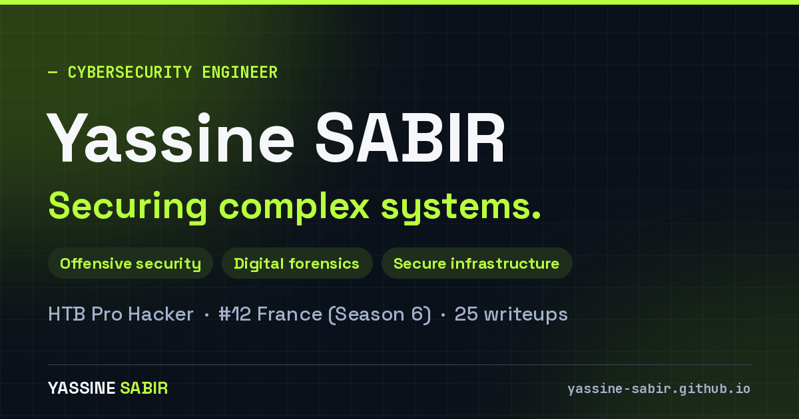

# Yassine SABIR — Cybersecurity Portfolio

[](https://yassine-sabir.github.io/)




Bilingual (EN/FR) portfolio of a cybersecurity engineer — offensive security, industrial forensics and secure infrastructure — with **28 Hack The Box / CTF writeups**.

## Highlights

- **Writeups** — searchable, filterable library; each report has a sticky table of contents, copyable code blocks and image zoom.
- **3D writeups globe** — responsive, touch/keyboard rotation, with a grid view as alternative.
- **Interactive terminal** — try `help`, `nmap ys4b`, `certs`.
- **Secure contact** — public key validated in the browser with [OpenPGP.js](https://openpgpjs.org/); optional local encryption so the form sends only ciphertext.
- **Light / dark themes**, shared design tokens, WCAG-minded contrast, `prefers-reduced-motion` support.
- **SEO** — Open Graph/Twitter previews per page, JSON-LD, sitemap.

## Run locally

```bash
python3 -m http.server 8000   # then open http://localhost:8000
```

No build step and no dependencies at runtime (OpenPGP.js is vendored).

## Structure

```
index.html            portfolio
writeups/             writeup library + one folder per report
css/                  tokens (variables.css), components, system.css (shared)
js/                   modules: theme, i18n, animations, pgp, features
assets/               images, CV, i18n, HTB data, og/ previews, vendor/
```

## Maintenance

| Task | How |
|---|---|
| Add a writeup | Add `writeups/<Name>/index.html` + entry in `writeups/writeups_data.json`|
| Enable the PGP channel | Export the public key to `assets/keys/sabir.yassine.asc` and pin its fingerprint in `js/config.js` (`gpg --show-keys --with-fingerprint`) |
| HTB stats | Synced hourly by `.github/workflows/get_htb_stats.yml` (validated before commit). Run it now: *Actions → Sync Hack The Box stats → Run workflow*. Optional secret `HTB_TOKEN` if the API requires auth |

## Contact

[LinkedIn](https://www.linkedin.com/in/sabir-yassine) · [Hack The Box](https://app.hackthebox.com/public/users/1041901) · sabir.yassine@proton.me

© Yassine SABIR. Third-party code keeps its own license (OpenPGP.js — LGPL-3.0; fonts — SIL OFL).
